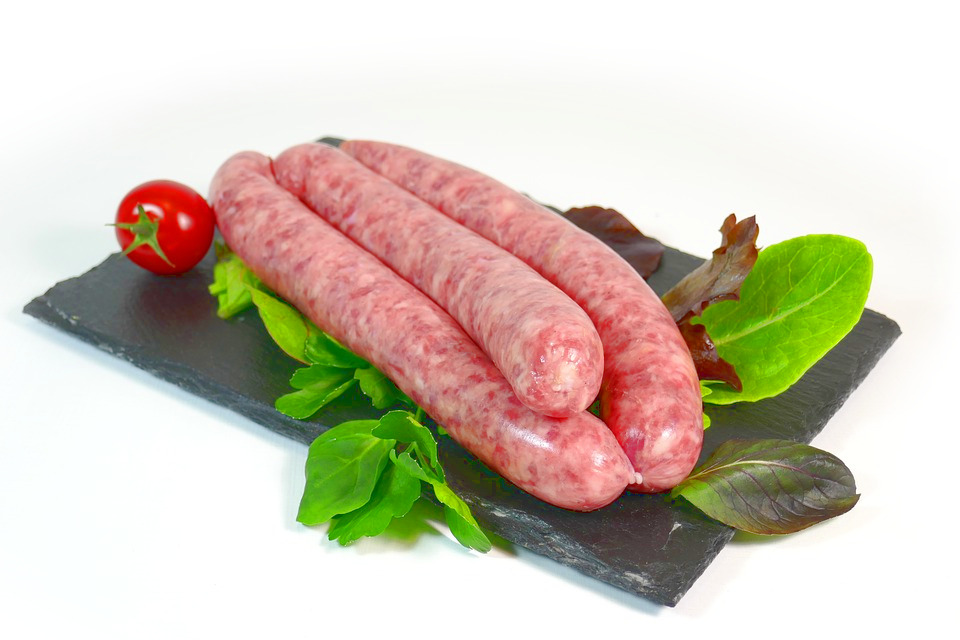

# serserge
Automated SCSS Shaping System



## Usage

```sh

npm -g i serserge

serserge -f nocolor bootstrap/scss bootstrap/nocolor

```

## Notes

Project is under active development.

## Snippets

    const example = postcss.plugin('example', function(){ return function(root, result) { console.log('ROOT',root); console.log('RESULT',result) } });
